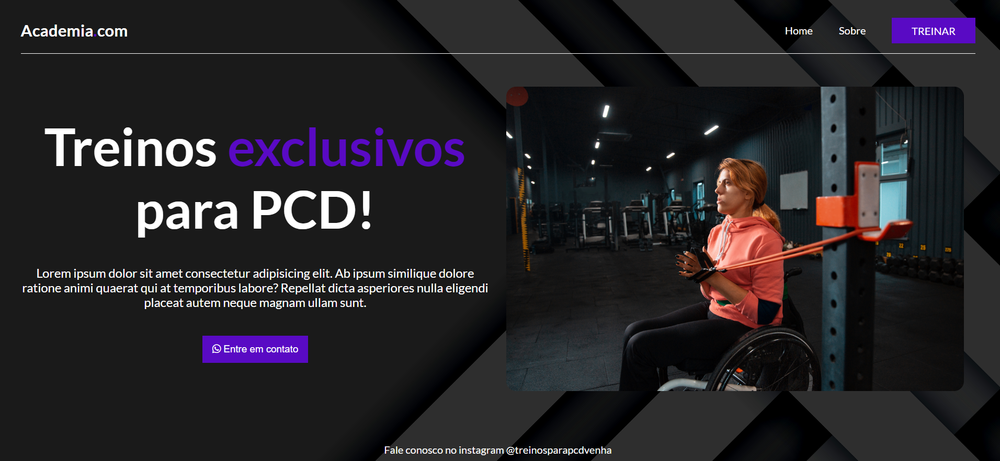
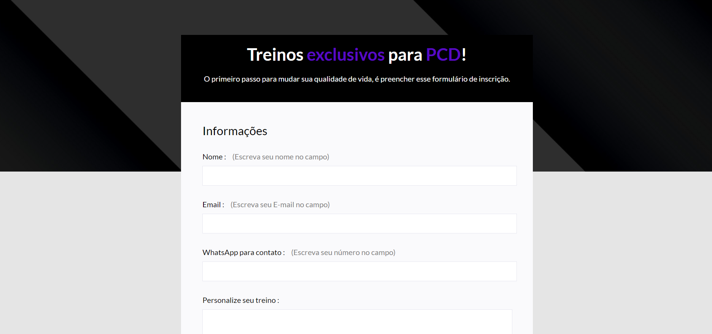
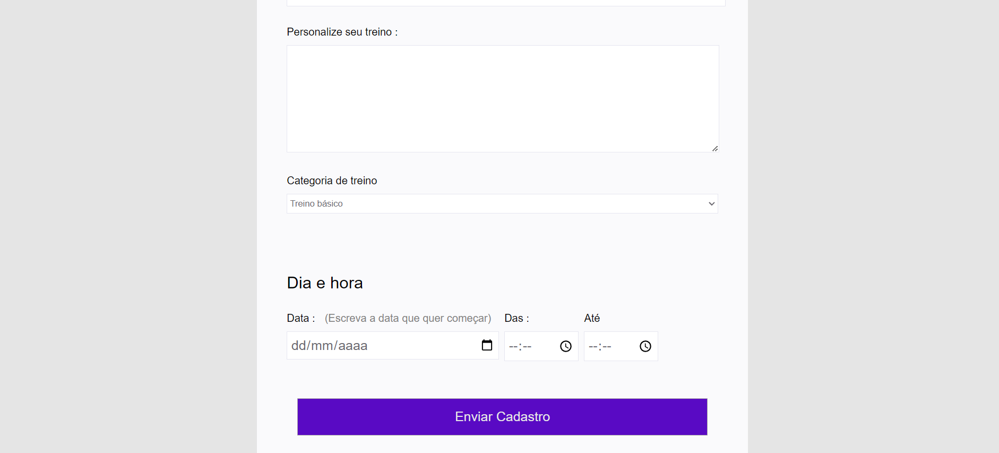

<h1>
        
</h1>
<h1>
        
</h1>
<h1>
        
</h1>

## 👩🏽‍💻 Sobre o Projeto Academia para PCD e Formulário 

Mas um projeto pronto e é um formulário para fazer inscrição para uma academia PCD. Foi desenvolvido com HTML e CSS.

## 👩🏽‍💻 Tecnologia Utilizada

O projeto foi desenvolvido com as seguintes tecnologias

- HTML

- CSS

## 👩🏽‍💻 Acesse o projeto

 <h3>
        <a href="https://lyrisnunes.github.io/academia-pcd/"> - Veja o projeto clique aqui </a>
</h3>